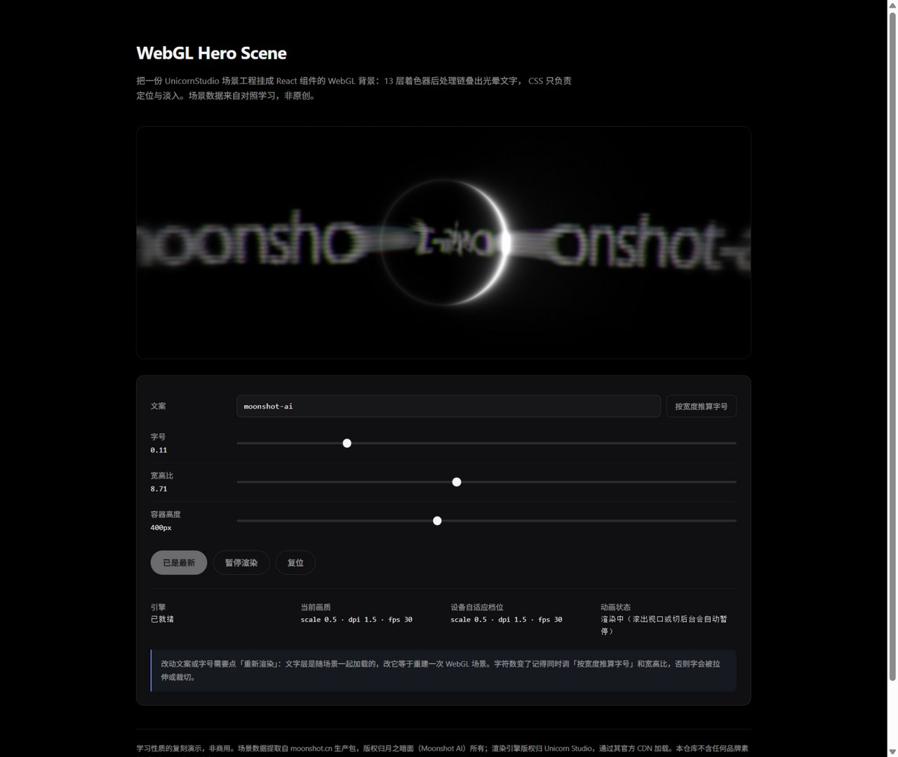

# WebGL Hero Scene

> 把一份 UnicornStudio 场景工程挂成 React 组件的 WebGL 光晕文字背景。

A React component that renders a WebGL glow-text hero background from a
[Unicorn Studio](https://www.unicorn.studio/) scene project — 13 shader layers chained
into a post-processing pipeline, no 3D library, no `three.js`.



## ⚠️ 使用前必读（授权边界）

这是一个**学习性质的复刻演示，非商用**。它不是一个可以随便拿去上生产的通用组件，动手前请先看清三条边界：

1. **引擎只能配 Unicorn Studio 的场景。** 引擎的许可写着「Permission is granted to use this software only for integration with legitimate Unicorn Studio projects」，并明确禁止「Using this software with non-Unicorn Studio projects」。也就是说：**场景必须在 Unicorn Studio 编辑器里做**，不能配手写 shader 或别的工具导出的 JSON。
2. **免费套餐限非商业个人项目，且导出内容带水印。** 平台条款原文：`You may use Unicorn Studio for non-commercial, personal projects only. A watermark will be included on all exported content. You may not remove, obscure, or attempt to circumvent...`。想去水印或用于商业站点，请订阅它的付费计划。
3. **本仓库里的场景数据不是我的，也不是你的。** `src/scenes/moonshotScene.ts` 提取自 `moonshot.cn` 生产包，版权归月之暗面所有，留在这里只作为技术学习的对照样本。请把它当演示用，不要直接搬上你自己的线上站点——换成你在 Unicorn Studio 里自己做的场景。

自有代码以 [MIT](LICENSE) 发布，**但不覆盖**上述第三方内容，详见 [THIRD-PARTY-NOTICES.md](THIRD-PARTY-NOTICES.md)。

## 这是什么

一个把「WebGL 场景工程」封装成可复用组件的实验，顺便把过程中值得讲清楚的几件事拆开了：

- **组件不画画面**。绘制全部由 GPU 上的 fragment shader 完成，组件只做参数注入、引擎加载、画质降级和暂停调度。
- **CSS 只负责布局**。容器尺寸、定位、一次淡入——仅此而已，没有任何视觉元素是 CSS 画的；组件把这些样式自动注入，使用方不用引任何样式表。
- **不是 `three.js`**。这是 2D 的图层后处理链（一层输出作为下一层输入纹理），没有相机、网格和光源。

演示页面（`npm run dev`）带一个实时控制面板：改文案、字号、宽高比、容器高度，可以直接看参数对效果的影响（改文字会重建场景，这是场景工程的加载机制决定的，不是 bug）。

## 效果是怎么实现的

场景工程是一份 JSON，13 个图层，每层都带着引擎编译好的 GLSL（`#version 300 es`）。
引擎把它们从上到下串成一条链，在 GPU 上逐像素叠出画面：

| 图层 | 作用 |
| --- | --- |
| `gradient` | 打底渐变 |
| `text` | 文字层（`opacity 0.42`），挂 `replicate` / `shatter` 两个子效果 |
| `replicate` | 复制残影 |
| `shatter` | voronoi 破碎，`trackMouse 0.8` —— 跟随鼠标 |
| `god_rays` / `beam` | 光束 |
| `progressive_blur` | 渐进模糊，**4 个 pass，辉光的主要来源** |
| `diffuse` / `liquify` / `fbm` | 扩散、液化、分形噪声 |
| `ripple` / `chromatic_aberration` / `retro_screen` | 波纹、色差、扫描线 |

所以那些「光晕」不是一个光晕贴图，是模糊 + 扩散 + 光束叠出来的。文字层本身只被组件改了四个字段：
`textContent`、`fontSize`、`aspectRatio`、`fontCSS.src`。

组件内部做的四件事：

1. **改写文字图层**：解析场景 JSON，定位 `layerType === 'text'` 的图层（或用 `textLayerId` 指定），改字段后重新序列化。
2. **把场景就地喂给引擎**：注入一个 `<script type="application/json" id="...">`，然后把这个 **id 当 `filePath` 传**——引擎会先 `document.getElementById(filePath)`，命中就直接解析，**不发网络请求**。这是能离线跑、也能绕过 CDN 抓场景的关键。
3. **按设备降级**：`deviceMemory` / `hardwareConcurrency ≤ 4` 或系统开了「减弱动效」时降一档（`scale 0.4 / dpi 1 / fps 24`，否则 `0.5 / 1.5 / 30`），也可用手动指定。
4. **暂停与回收**：滚出视口（`IntersectionObserver`，阈值 0.05）、切到后台（`visibilitychange`）、或者 `prefers-reduced-motion` 时置 `handle.paused = true`；卸载时 `destroy()` 释放 WebGL 上下文。

## 在别人的项目里用它

### 方式一：React 项目，直接从 GitHub 装

`dist-lib/` 已预构建并随仓库提交，所以装的时候**不需要**任何构建步骤（React 是 peerDependency，用的是你自己项目里那份）：

```bash
npm install github:Z41sArrebol/webgl-hero-scene
# 国内网络如果 GitHub HTTPS 不通，用 SSH 形式：
npm install git+ssh://git@github.com/Z41sArrebol/webgl-hero-scene.git
```

```tsx
import { HeroScene, MOONSHOT_SCENE } from 'webgl-hero-scene'

export default function Hero() {
  return (
    <HeroScene
      scene={MOONSHOT_SCENE}   // 换成你自己在 Unicorn Studio 里做的场景
      text="moonshot-ai"
      fontSize={0.11}          // 11 个字符
      aspectRatio={8.71}       // 与上面配套
      height={400}
      onError={(error) => console.warn(error.message)}
    />
  )
}
```

样式由组件运行时自动注入，**不需要** `import '.../style.css'`。Next.js App Router 里记得在组件所在文件顶部加 `'use client'`（组件内部用了 `useEffect` / `document`，但 SSR 阶段不会碰它们）。

如果站点 CSP 不允许内联样式，传 `injectStyles={false}`，并改用导出的 `HERO_SCENE_CSS` 自己落成静态 CSS。

### 方式二：不装包，直接拷文件

把这三个文件拷进项目，改一下相对路径即可（零依赖，除了 React）：

```
src/components/HeroScene.tsx     组件本体
src/lib/heroSceneStyles.ts       自带样式（自动注入）
src/scenes/moonshotScene.ts      场景数据（换你自己的）
```

### 方式三：非 React 项目（Hugo / Hexo / Jekyll / 静态 HTML / 任意 CMS）

引擎跟框架无关，看 [`examples/vanilla/index.html`](examples/vanilla/index.html)：一个不依赖任何框架的页面，`loadSdk` → 注入场景 JSON → `UnicornStudio.addScene()` → 按可见性暂停，四十行左右。本地跑：

```bash
python -m http.server 5197 --directory examples/vanilla
# 或 npx serve examples/vanilla
```

`examples/vanilla/scene.json` 由 `npm run export:scene` 从 TS 源生成，保证仓库里只有一份场景数据。

### 本地开发这个仓库

```bash
npm install
npm run dev         # 演示页（带控制面板）
npm run build       # 演示页构建（含 tsc 类型检查）
npm run build:lib   # 构建 dist-lib（ESM + CJS + .d.ts），提交前跑
npm run export:scene
```

## Props

| 属性 | 类型 | 默认值 | 说明 |
| --- | --- | --- | --- |
| `scene` | `string` | **必填** | UnicornStudio 场景工程 JSON 字符串 |
| `text` | `string` | — | 写入文字层的文案 |
| `fontSize` | `number` | — | 文字层相对字号（相对画布宽） |
| `aspectRatio` | `number` | — | 文字层宽高比 |
| `fontSrc` | `string` | 本仓库字体的 CDN 地址 | 场景字体，替换成自己的字体 |
| `textLayerId` | `string` | 第一个 text 图层 | 指定要改写的图层 `id` |
| `height` | `number \| string` | `400` | 容器高度，数字按 px |
| `sdkUrl` | `string` | 官方 jsDelivr `v2.1.4` | 引擎地址，可换成自备副本 |
| `quality` | `'auto' \| Partial<SceneQuality>` | `'auto'` | 画质策略，可手动指定 `scale` / `dpi` / `fps` |
| `pauseOffscreen` | `boolean` | `true` | 滚出视口时暂停渲染 |
| `paused` | `boolean` | `false` | 由外部强制暂停（切换时不会重建场景） |
| `fallbackImg` | `string` | — | 引擎加载失败时的兜底图 |
| `injectStyles` | `boolean` | `true` | 是否自动注入自带样式 |
| `className` / `style` | — | — | 透传到容器 |
| `onReady` | `(quality: SceneQuality) => void` | — | 引擎就绪，返回最终生效的画质 |
| `onError` | `(error: Error) => void` | — | 引擎加载失败或场景 JSON 非法 |

除了组件，还导出这些：

```ts
import {
  HeroScene,              // 组件（也有默认导出）
  detectQuality,          // () => { reduced, scale, dpi, fps }
  withTextLayer,          // (sceneJson, override) => 改写后的 JSON 字符串
  HERO_SCENE_CSS,         // 自带样式的原始字符串（CSP 场景用）
  ensureHeroSceneStyles,  // 手动触发样式注入
  MOONSHOT_SCENE,         // 演示场景（注意上面第 3 条）
} from 'webgl-hero-scene'
import type { HeroSceneProps, SceneQuality, SceneTextOverride } from 'webgl-hero-scene'
```

**默认字体**走 jsDelivr 取本仓库里那份 Noto Sans（OFL），所以使用方不需要自备字体文件；想换字体传 `fontSrc`。

## 换成自己的场景

场景 JSON 是通用的，换成自己的项目就是换个字符串：

1. 在 [Unicorn Studio](https://www.unicorn.studio/) 编辑器里做好场景，导出工程 JSON；
2. 存成 `src/scenes/myScene.ts`：`export const MY_SCENE: string = '{"history": ...}'`；
3. `<HeroScene scene={MY_SCENE} />`。

**改文案的两个数字必须配套**：`fontSize` 是相对画布宽的比例，`aspectRatio` 是文字图层的宽高比，
文字是先光栅化成贴图、再按图层框拉伸的，两者和字符数不匹配就会被拉伸或裁切。经验规则是
「保持总宽度不变」——11 个字符用 `0.11`，n 个字符用 `0.11 × 11 / n`（演示页的「按宽度推算字号」
按钮就是这个式子），同时把 `aspectRatio` 调到跟新文案相称。

## 性能与暂停

- 每个组件实例对应一个独立的 WebGL 场景和上下文，**同屏建议不超过 10 个**（浏览器上下文上限约 16 个）。
- 三个暂停条件：滚出视口、切到后台、`prefers-reduced-motion`（后者是硬暂停，用于尊重系统减弱动效设置）。
- 引擎 SDK 全局只加载一次，`paused` 切换走独立同步路径，不会重建场景。
- 包体积参考：库产物 51KB（gzip 11KB，其中场景 JSON 占大头）+ 引擎 123KB（从 CDN 加载，gzip 约 33KB）。

## 已知限制

- **改 `scene` / `text` / `fontSize` 会重建整个场景**。文字层是随场景一起加载的，引擎没有提供运行时的图层更新 API。
- 需要 WebGL2 支持。
- 引擎是 UMD 全局脚本，会挂到 `window.UnicornStudio`；组件手写了它的类型声明，官方没有 `.d.ts`。
- 默认从 CDN 加载引擎，离线使用请自备副本并通过 `sdkUrl` 指定（注意第 1、2 条授权边界）。

## 免责声明

- 本仓库是**个人学习性质的复刻演示，非商用**，与月之暗面（Moonshot AI）及 Unicorn Studio **无任何关联或背书关系**。
- `src/scenes/moonshotScene.ts` 的场景数据提取自 `moonshot.cn` 的线上生产包，**不是原创作品**，版权归月之暗面所有，仅作技术学习的对照样本。若权利人认为不妥，联系后会立即移除。
- 渲染引擎版权归 Unicorn Studio（UNCRN LLC）；本仓库不包含引擎副本，运行时通过其官方 CDN 加载，使用条款以官方说明为准（见开头「使用前必读」）。
- 为规避品牌与素材风险，本仓库**不包含**官网的任何商标、Logo、图片、视频素材，也不包含官网前端生产包原件。
- `public/assets/NotoSans-Latin.woff2` 为 Noto Sans（SIL OFL 1.1），属于第三方内容。
- 自有代码以 [MIT](LICENSE) 发布；**MIT 不覆盖上述第三方内容**，详见 [THIRD-PARTY-NOTICES.md](THIRD-PARTY-NOTICES.md)。

## 致谢

- [Unicorn Studio](https://www.unicorn.studio/) —— 场景编辑器与渲染引擎，整个效果的地基。
- 月之暗面官网 —— 作为学习复刻的对照样本。
- Noto Sans —— 场景引用的字体。
